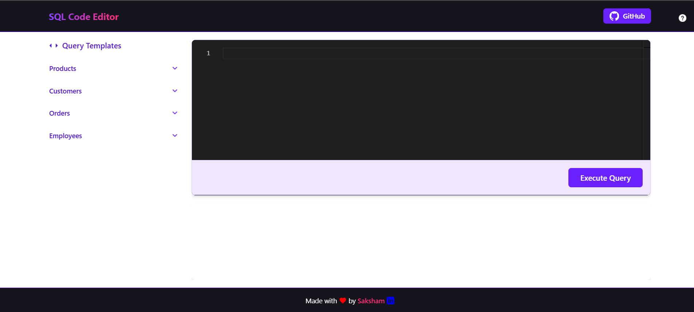
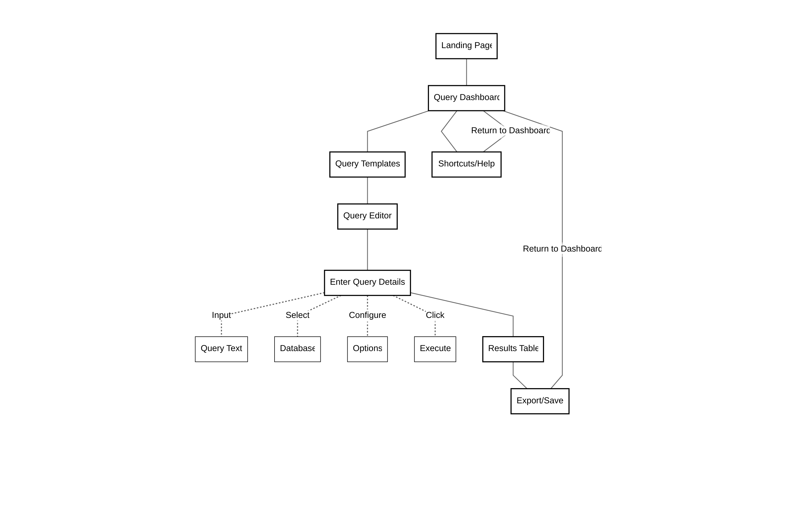
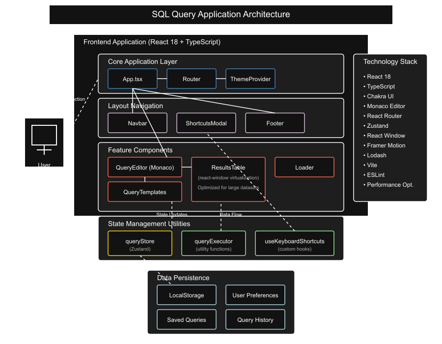
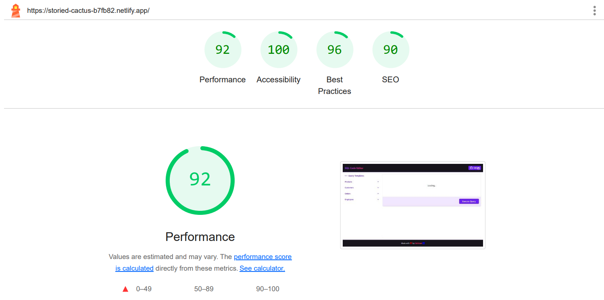
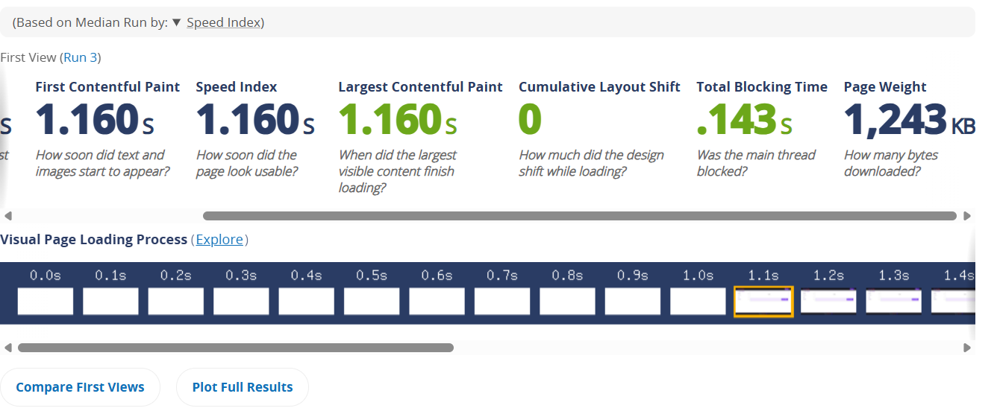

# [Query Karta](https://storied-cactus-b7fb82.netlify.app/)



> A high-performance SQL query editor built with React and TypeScript, featuring real-time query execution and result visualization.

## Solution

SQL Query Editor provides a modern, fast, and intuitive interface for data analysts to write, execute, and visualize SQL queries. Built with performance in mind, it offers features like syntax highlighting, intelligent autocompletion, and efficient rendering of large datasets, making it an ideal tool for data exploration and analysis.

## Features

- Professional Code Editor with Monaco
- Intelligent SQL Autocompletion
- Multiple Query Templates
- High-Performance Data Grid
- Keyboard Shortcuts
- Clean, Modern UI
- Responsive Design
- Query History
- Export Functionality

## Flow Diagrams

### Frontend Flow



### Component Architecture



## System Design


## 🛠️ Technical Stack

- **Framework**: React 18 with TypeScript
- **Build Tool**: Vite (for lightning-fast builds)
- **UI Library**: Chakra UI
- **Editor**: Monaco Editor
- **State Management**: Zustand
- **Routing**: React Router DOM

## 📊 Performance Metrics



### Page Load Time
- Initial Load: ~0.9s
- Subsequent Loads: ~0.8s (leveraging browser caching)
- First Contentful Paint (FCP): ~0.5s
- Largest Contentful Paint (LCP): ~1.52s

### Performance Optimizations
1. **Code Splitting**
   - Lazy loading of Monaco Editor
   - Route-based code splitting

2. **Asset Optimization**
   - Gzip compression enabled
   - Image optimization using Vite plugins

3. **State Management**
   - Efficient state updates using Zustand
   - Memoized selectors for preventing unnecessary rerenders

4. **Large Dataset Handling**
   - Virtualized scrolling for large result sets
   - Chunked data loading
   - Debounced search operations

### Load Time Breakdown



## 🏃‍♂️ Getting Started

### Prerequisites
- Node.js 18+
- npm or yarn

### Installation

```bash
# Clone the repository
git clone https://github.com/SakshamTolani/query-karta

# Install dependencies
cd sql-editor
npm install

# Start development server
npm run dev
```

Visit `http://localhost:5173` to see the application.

## 🎯 Usage

1. Select a query template from the dropdown or write your own SQL
2. Use Ctrl/Cmd + Enter to execute the query
3. View results in the data grid below
4. Export results as CSV if needed

### Keyboard Shortcuts

| Shortcut | Action |
|----------|--------|
| Ctrl + Enter | Execute Query |
| Ctrl + S | Save Query |
| Ctrl + / | Toggle Comment |
| Ctrl + Space | Trigger Autocomplete |

## 📝 Demo Queries

The application comes with several pre-loaded queries:

```sql
-- Sample Query 1
SELECT * FROM employees WHERE department = 'Sales' LIMIT 1000;

-- Sample Query 2
SELECT department, COUNT(*) as count 
FROM employees 
GROUP BY department 
ORDER BY count DESC;
```

## 🔧 Configuration

Environment variables can be configured in `.env`:

```env
VITE_API_ENDPOINT=your_api_endpoint
VITE_MAX_ROWS=10000
VITE_COMPRESSION_ENABLED=true
```

## 🌟 Future Enhancements

- Query history with undo/redo
- Real-time collaboration
- Query plan visualization
- Schema browser
- Custom theme support

## 📫 Contact

Saksham Tolani Name - [@linkedin](https://linkedin.com/in/saksham-tolani)

Project Link: [https://github.com/SakshamTolani/query-karta](https://github.com/SakshamTolani/query-karta)

## 🙏 Acknowledgments

- [Monaco Editor](https://microsoft.github.io/monaco-editor/)
- [Chakra UI](https://chakra-ui.com/)
- [Atlan Team](https://atlan.com/) for the opportunity

---

Built with ❤️ for Atlan Frontend Internship 2025
````
